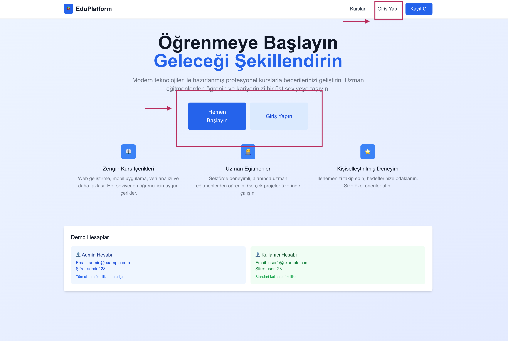
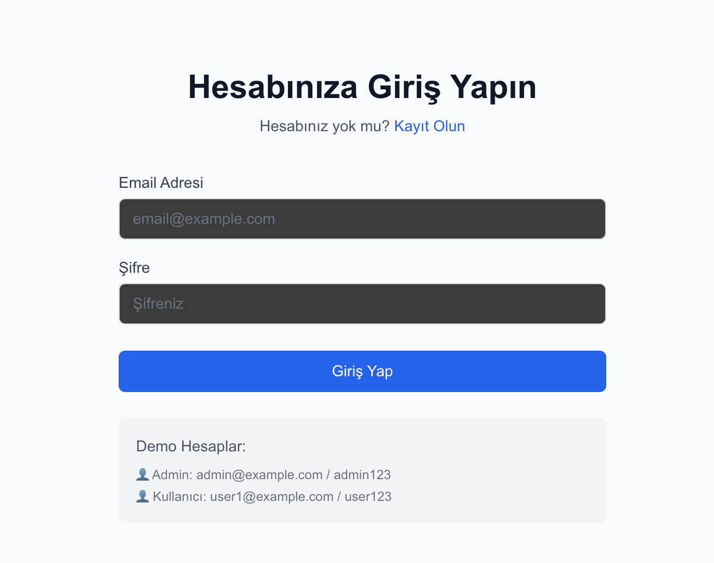
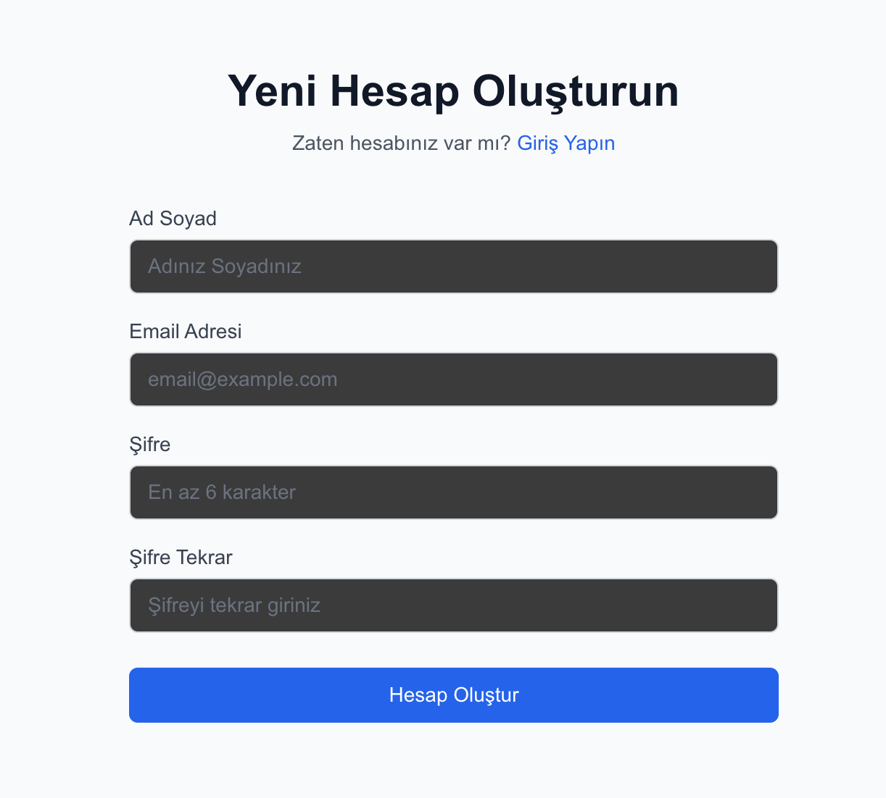
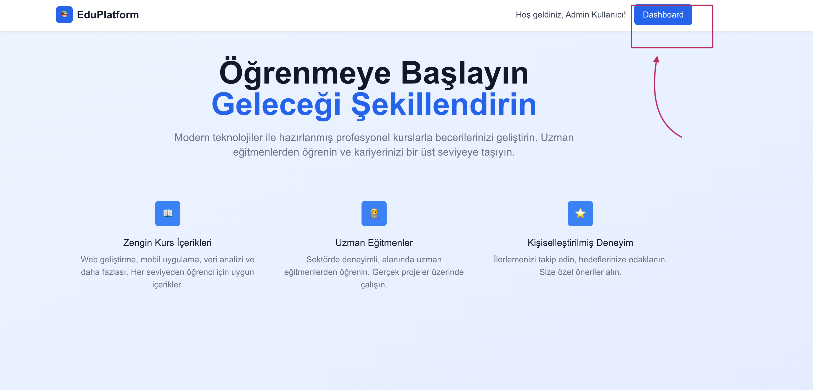
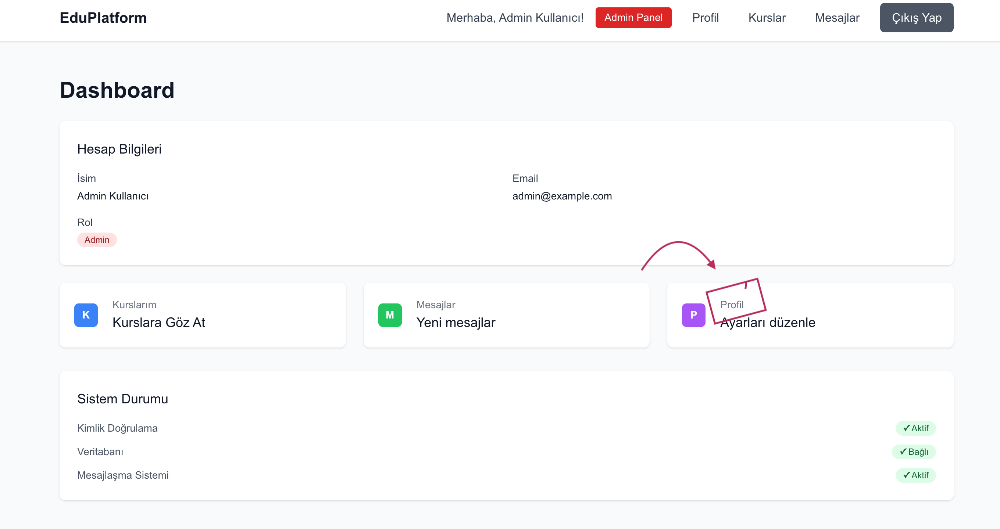
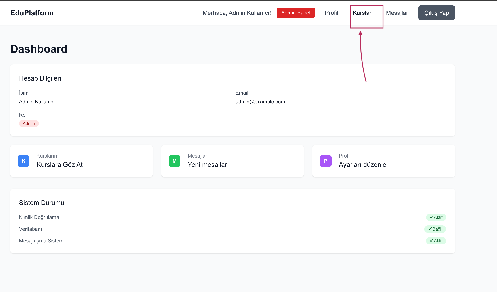
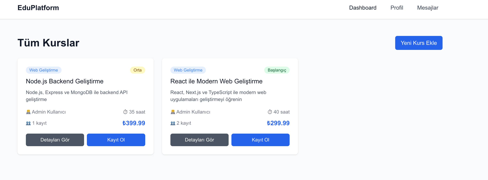
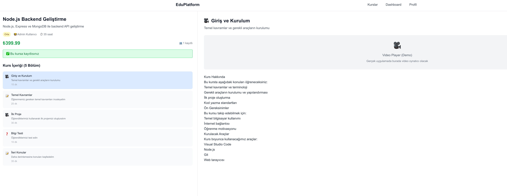
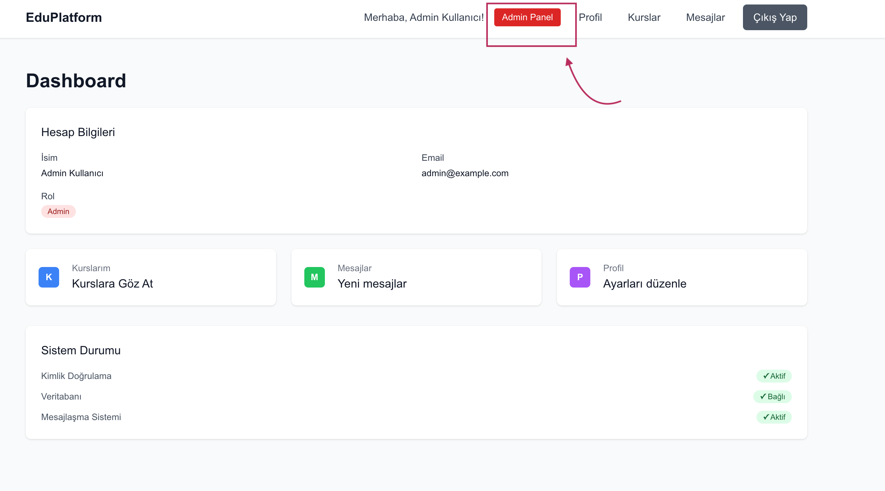
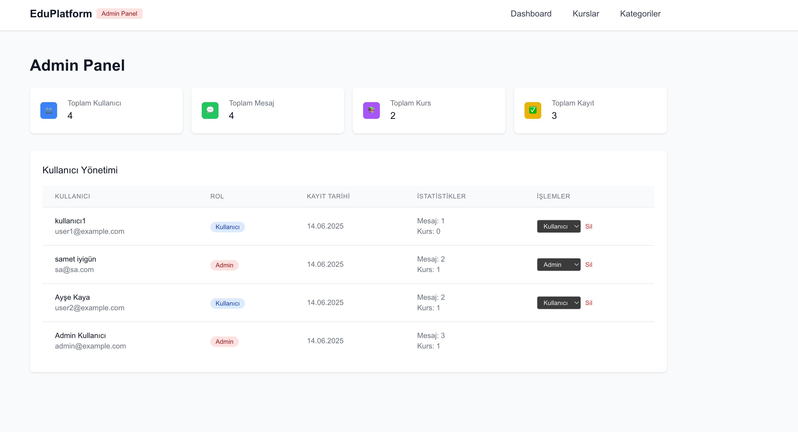

SametIyigun23480726IntPrgIIFinalProje - Kurs Yönetim Sistemi

PROJE TANIMI

Bu proje, öğrencilerin kursları görüntüleyebildiği, kayıt olabildiği ve kurs içeriklerini takip edebildiği modern bir kurs yönetim sistemidir. Aynı zamanda kullanıcılar birbirleriyle mesajlaşabilir ve profillerini yönetebilirler. Sistem rol tabanlı erişim kontrolü ile çalışır - normal kullanıcılar ve admin kullanıcıları bulunur.

Proje aşağıdaki ana problemleri çözer:
- Kurs kataloglarının düzenli ve erişilebilir şekilde sunulması
- Öğrenci kayıt ve takip sisteminin otomatikleştirilmesi
- Kullanıcı profil yönetimi ve kimlik doğrulama
- Kullanıcılar arası iletişim platformu
- Admin paneli ile sistem yönetimi

KULLANILAN TEKNOLOJILER

Frontend:
- Next.js 15.3.3 (React framework)
- React 19 (Kullanıcı arayüz kütüphanesi)
- TypeScript (Tip güvenliği için)
- Tailwind CSS (Styling framework)

Backend ve Veritabanı:
- Prisma (ORM ve veritabanı yönetimi)
- SQLite (Veritabanı)
- NextAuth.js (Kimlik doğrulama)
- bcryptjs (Şifre hashleme)

Doğrulama ve Yardımcı Araçlar:
- Zod (Schema doğrulama)
- Node.js (Runtime ortamı)

KURULUM TALIMATLARI

Proje GitHub'dan indirildikten sonra hemen çalıştırılabilir durumda gelir!

1. Gereksinimler
Sisteminizde Node.js (v18 veya üzeri) ve npm yüklü olmalıdır.

2. Projeyi İndirin
git clone https://github.com/sametiyigun/sametiyigun23480726intprgiifinalproje.git

cd sametiyigun23480726intprgiifinalproje

3. Bağımlılıkları Yükleyin ve Başlatın

npm install

npm run dev

Uygulama http://localhost:3000 adresinde çalışmaya başlayacaktır.

NOT: Proje .env dosyası ve örnek veritabanı ile birlikte gelir, ek kurulum gerekmez!

ADMIN GIRIS BILGILERI

Test amaçlı admin hesabı:
Email: admin@example.com
Şifre: admin123

Bu hesap ile giriş yaptığınızda admin paneline erişebilir, tüm kullanıcıları yönetebilir ve sistem istatistiklerini görüntüleyebilirsiniz.

Ek test hesapları:
Email: user1@example.com, Şifre: user123
Email: user2@example.com, Şifre: user123
Email: user3@example.com, Şifre: user123

KULLANIM KILAVUZU

1. Ana Sayfa ve Giriş

Projeyi çalıştırdıktan sonra ana sayfada hoş geldiniz mesajı ve giriş-kayıt butonları bulunur. Altta demo hesap bilgileri gösterilir.

Giriş yapmak için:
- Sağ üstteki "Giriş Yap" butonuna tıklayın
- Email ve şifre bilgilerinizi girin
- "Giriş Yap" butonuna tıklayın

Yeni hesap oluşturmak için:
- "Kayıt Ol" butonuna tıklayın
- Ad, email ve şifre bilgilerinizi girin
- "Hesap Oluştur" butonuna tıklayın

2. Dashboard (Kontrol Paneli)

Giriş yaptıktan sonra dashboard butonuna basarsanız sayfanıza yönlendirilirsiniz. Bu sayfada:

- Kişisel hesap bilgileriniz görünür
- Hızlı erişim linkleri bulunur (Kurslar, Mesajlar, Profil)
- Sistem durumu bilgileri gösterilir
- Admin kullanıcılar için "Admin Panel" butonu görünür

3. Profil Yönetimi

Profil sayfasında kullanıcı bilgilerinizi görüntüleyebilir ve düzenleyebilirsiniz:
- Profil fotoğrafı (avatar)
- Ad ve email bilgileri
- Hakkında (bio) bilgileri
- Hesap oluşturma tarihi
- Rol bilgisi (Admin/Kullanıcı)

Profil bilgilerini düzenlemek için "Düzenle" butonuna tıklayın.

4. Kurslar

Kurslar sayfasında mevcut tüm kursları görüntüleyebilirsiniz:
- Kurs başlığı ve açıklaması
- Kategori bilgisi (renk kodlu)
- Eğitmen bilgileri
- Kurs süresi ve fiyat bilgisi
- Kayıt sayısı

Kurs detaylarını görmek için "Detayları Gör" butonuna tıklayın.
Kursa kaydolmak için "Kayıt Ol" butonunu kullanın.

5. Kurs İçerikleri

Bir kursa kaydolduktan sonra kurs detay sayfasında:
- Sol panelde kurs bilgileri ve içerik listesi
- Sağ panelde seçilen içerik gösterilir
- Farklı içerik türleri: Giriş ve Kurulum, Temel Kavramlar, İlk Proje, Blog Tasarı, İleri Konular

6. Mesajlaşma Sistemi

Mesajlar sayfasında diğer kullanıcılarla iletişim kurabilirsiniz:
- Sol panelde kullanıcı listesi
- Sağ panelde seçilen kullanıcıyla mesaj geçmişi
- Alt kısımda mesaj yazma alanı
- "Gönder" butonu ile mesaj gönderme

7. Admin Panel (Sadece Admin Kullanıcıları)

Admin hesabıyla giriş yaptığınızda erişebileceğiniz özellikler:

Kullanıcı Yönetimi:
- Tüm kullanıcıları listeleme
- Kullanıcı rollerini değiştirme (Admin/Kullanıcı)
- Kullanıcı silme işlemleri
- Kullanıcı istatistikleri (mesaj ve kurs sayıları)

Sistem İstatistikleri:
- Toplam kullanıcı sayısı
- Toplam mesaj sayısı
- Toplam kurs sayısı
- Toplam kayıt sayısı

Kategori Yönetimi:
- Kategori listeleme
- Yeni kategori ekleme
- Kategori düzenleme
- Kategori silme (kurslar yoksa)
- Kategori renk ayarları

PROJE HAKKINDA EK BILGILER

Veritabanı Yapısı:
Proje SQLite veritabanı kullanır ve 5 ana tablodan oluşur:
- users (kullanıcı bilgileri)
- categories (kurs kategorileri)
- courses (kurs bilgileri)
- enrollments (kullanıcı-kurs kayıtları)
- messages (mesajlaşma sistemi)

Ana Özellikler:
- Kurs katalogları ve kayıt işlemleri
- Kullanıcı profil yönetimi
- Mesajlaşma sistemi
- Admin paneli
- Kategori yönetimi
- Responsive tasarım (mobil uyumlu)

